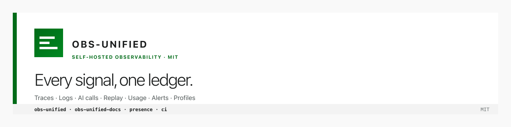

<picture>
  <source media="(prefers-color-scheme: dark)" srcset="./banner-dark.png">
  
</picture>

# obs-unified

**Self-hosted observability for the whole stack.** One collector ingests every signal — traces, logs, AI calls, session replay, usage, alerts, profiles — and correlates them end-to-end through a single identity chain:

```
user_id → session_id → interaction_id → trace_id → span_id
```

No external telemetry vendor. MIT-licensed. Runs on Cloudflare Workers + D1 + R2, with a Node collector path backed by Postgres + S3-compatible blob storage.

→ **[docs.obsunified.com](https://docs.obsunified.com)** · **[obsunified.com](https://obsunified.com)**

## Repositories

| Repo | What it is |
|---|---|
| [`obs-unified`](https://github.com/obs-unified/obs-unified) | The product. Collector + SDKs (telemetry, analytics, types, cli, dashboard, pprof-decoder) + polyglot SDKs (Node, Go, Rust). pnpm monorepo. Design and usage documented publicly at [docs.obsunified.com](https://docs.obsunified.com). |
| [`obs-unified-docs`](https://github.com/obs-unified/obs-unified-docs) | The documentation site. Fumadocs on React Router 7. Live at [docs.obsunified.com](https://docs.obsunified.com). |
| [`presence`](https://github.com/obs-unified/presence) | The landing page. Vanilla TS + Vite, AEO-optimized. Live at [obsunified.com](https://obsunified.com). |
| [`ci`](https://github.com/obs-unified/ci) | Self-hosted GitHub Actions runners + Cloudflare deploy automation. Shell scripts; auto-sources `.env.deploy` for the Cloudflare API token. |

## Where to start

- **Install** → [docs.obsunified.com/docs/installation](https://docs.obsunified.com/docs/installation)
- **Architecture** → [docs.obsunified.com/docs](https://docs.obsunified.com/docs)
- **Contribute** → start in the repo you're touching; each `CONTRIBUTING.md` points at the canonical guide in `obs-unified/CONTRIBUTING.md`
- **Stand up CI for the org** → [obs-unified/ci](https://github.com/obs-unified/ci)

## Stack

| Layer | Tech |
|---|---|
| Collector | Hono on Cloudflare Workers with D1/R2, or Node with Postgres/S3-compatible storage |
| Backend SDKs | TypeScript (Workers, Hono, Next.js, Express), Go, Rust |
| Frontend SDK | Vanilla browser + React provider, rrweb session replay |
| Dashboard | React + Vite |
| Docs site | Fumadocs on React Router 7 (SPA) |
| Landing | Vanilla TypeScript + Vite |
| Deploy | Cloudflare Pages (sites), Cloudflare Workers (collector) |
| CI | Self-hosted GitHub Actions runner ([`ci/`](https://github.com/obs-unified/ci)) |

## License

MIT, across all public repos.
